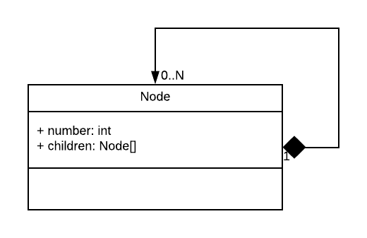

# Family Tree

El presente código contiene una representación de un árbol de números. Un árbol es una estructura que consiste de nodos conectados. Cada nodo contiene un dato (número) y una lista de nodos hijos, como muestra el siguiente diagrama:



Un nodo que no tiene hijos diremos que es una "hoja".

Además, el código contiene una implementación muy sencilla del patrón [Visitor](https://refactoring.guru/design-patterns/visitor). El __visitor__ recorre el árbol y calcula la suma de todos los números.

Por ejemplo, dado un árbol:

```
    1
   / \
  2   3
```

El patrón  es un excelente aliado cuando necesitamos recorrer estructuras y realizar operaciones sobre ellas. Por ejemplo, podemos aplicar el patrón Visitor para recorrer el árbol del ejemplo anterior y calcular la suma de sus nodos, cuyo resultado es 6.

## Parte 1: Abstracción del arbol

Como primer objetivo, deberán modificar el programa para poder representar un árbol familiar. Un árbol familiar es un árbol cuyos nodos contienen una persona. Para este caso, nos iteresa el nombre y la edad de cada persona.

Verán que la implementación del árbol provista es bastante rígida. Será tarea de ustedes modificar la implementación para hacerla más abstracta, de forma de poder tener tanto árboles de `int` como el provisto, pero también árboles de la clase `Person` que vas a crear.

## Parte 2: Árbol genealógico

Crear en el `Program.cs` una estuctura de árbol de `Person` para representar un árbol genealógico. Incluyan al menos 7 personas.

## Parte 3: Visitador

Para esta parte deberán aplicar el patrón Visitor, implementando un visitador para calcular la suma de las edades de todos los integrantes de la familia.

## Parte 4: ¿Abierto a la extensión?

Para esta última parte, deberán crear 2 nuevos visitadores:

1️⃣ El primero vistará el árbol genealógico para determinar la edad del hijo más grande (hijo = nodos hojas)

2️⃣ El segundo visitará el árbol genealógico y determinará quién tiene el nombre más largo.